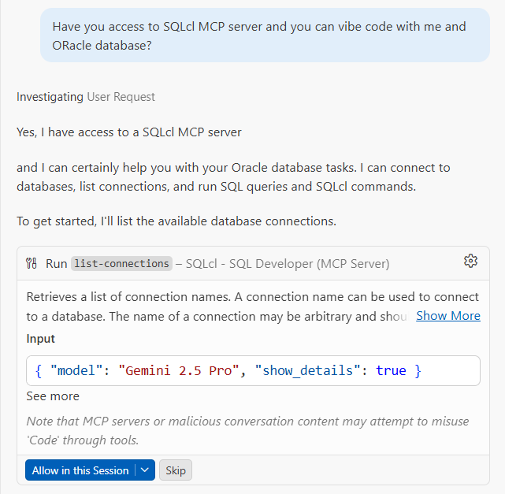

# Vibe Lab Opus No. 1

This tutorial shows how to interact with Oracle database in vibe coding manner so how to use natural language to interact with Oracle database using official Oracle MCP server.

## Required tools

Before you start you have to make sure that you have installed tools listed below. If not - don't worry there are plenty of tutorials on the web how to do this. 

- **Visual Studio Code**
- **SQLcl** (https://www.oracle.com/database/sqldeveloper/technologies/sqlcl/)
- **Oracle SQL Developer Extension for VSCode** (installation from *Extensions* tab in VS Code)
- **GitHub Copilot**
- **Docker**

In case of **SQLcl** tool, tou have to download the .zip archive and add it to PATH manually.

You can test it in terminal by:

```txt
PS > sql
SQLcl: Release 25.4 Production on Sat Mar 28 09:41:03 2026

Copyright (c) 1982, 2026, Oracle.  All rights reserved.

Username? (''?)
```

If you see output similar to this it means that you install this tool correctly.

## Basics

### What is MCP?

<!-- Another thoughts about "today coding"  -->

## What is an MCP Server?

MCP stands for **Model Context Protocol** Server.

### Simple Explanation:
An MCP Server is a program that acts as a bridge between AI models (like Claude, ChatGPT) and external tools or data sources. It allows AI assistants to:

- **Access external information** - Connect to databases, APIs, or files
- **Perform actions** - Execute commands, read/write data, interact with systems
- **Extend capabilities** - Give AI assistants new skills beyond their built-in knowledge

### Key Points:
- It follows a specific protocol (MCP) that defines how communication happens
- Works like a "plugin" or "extension" for AI models
- Enables real-time data access and tool integration
- Runs as a separate service that the AI model can communicate with

### Example Use Cases:
- Connecting an AI to your company database
- Allowing AI to read and write files
- Integrating with version control systems (like Git)
- Accessing weather APIs or real-time information
- Running code or scripts

Think of it as a **translator and connector** that lets your AI assistant talk to the outside world!

## Start tutorial

### Set up database

To start with this material we particularly need a database. Don't worry I have prepared one for you. Simply use the *docker-compose.yml* file. But remember to put correct system path in **volumes** section of *docker-compose.yml* file. On this path Oracle specific files will be copied.

```bash
docker compose -f 'ora\docker-compose.yml' up -d --build 
```

or just click play button if you have installed Docker extensions in VSCode.

**Please be patient because first start can last a few minutes.**

If you will see this in logs of docker container:

```txt
#########################
DATABASE IS READY TO USE!
#########################
```

it means that you can have fun with Oracle DB.

### Verify toolset

Now you have verify that you have install:

- SQLcl
- VSCode extension: Oracle SQL Developer Extension for VSCode
- VSCode extension: GitHub Copilot Chat

I strongly reccomend you to install also VSCode extensions:
- Container tools
- Docker 

if it is not installed yet. Remember always download verified extensions from well-known vendors.

To continue this tutorial you have to have active GitHub Copilot licence.

#### Connection Setup with Oracle SQL Developer Extension

1. **Open the Oracle SQL Developer Extension**
    - Click on the Oracle SQL Developer icon in the VSCode sidebar
    - Or use the Command Palette (`Ctrl+Shift+P`) and search for "Oracle"

2. **Add a New Connection**
    - Click the "+" button or "Add Connection" option
    - A connection dialog will appear

3. **Enter Connection Details**
    - **Connection Name**: Give your connection a meaningful name (e.g., "LocalOracleDB")
    - **Hostname/IP**: Enter the database server address (for Docker: `localhost`)
    - **Port**: Default Oracle port is `1521`
    - **Service Name or SID**: Enter the service name (e.g., `FREEPDB1`)
    - **Username**: Enter your Oracle username
    - **Password**: Enter your password
    - **Save Password**: Check if you want VSCode to remember credentials

4. **Test the Connection**
    - Click the "Test Connection" button
    - Wait for confirmation that the connection is successful

5. **Save the Connection**
    - Click "Save" to store the connection configuration
    - The connection will now appear in the Oracle SQL Developer panel

6. **View Connected Database**
    - Expand the connection to see schemas, tables, and other database objects
    - You can now browse and interact with your Oracle database directly from VSCode

### Create user, tables and fill it

Try to make a connection by SYS user to database with
service name: FREEPDB1.

Next simply run the SQL scripts from *./init-scripts* catalogue in order: *1.sql*, *2.sql*, *3.sql*.s

### Plain SQL scripts

Plain SQL scripts in VSCode allow you to write and execute SQL queries directly in `.sql` files. You can:

- **Create SQL files** - Use the `.sql` extension for your scripts
- **Execute queries** - Right-click in the editor and select "Run Query" or use the Oracle SQL Developer Extension
- **View results** - See output in the "Results" panel below the editor
- **Syntax highlighting** - Get automatic syntax highlighting and code completion
- **Quick testing** - Ideal for rapid query development before using in notebooks or applications

This approach is perfect for simple, straightforward SQL execution and scripting without the overhead of notebook environments.

### Oracle SQL Notebooks

Oracle SQL Notebooks in VSCode provide an interactive environment for writing and executing SQL queries with built-in visualization and documentation. They combine markdown text with executable SQL cells, allowing you to:

- **Write and execute SQL** - Run queries directly within the notebook interface
- **Document your work** - Mix SQL code with markdown explanations
- **View results inline** - See query outputs immediately below each cell
- **Create reproducible workflows** - Save complete SQL analysis sessions

This makes notebooks ideal for exploratory data analysis, testing queries before production use, and creating interactive SQL documentation.


### Create dedicated user and connection for AI agent

#### Why a Dedicated User is Crucial

**Principle of Least Privilege**
- Restricts the AI agent to only the permissions it absolutely needs
- Prevents unauthorized access to sensitive system resources
- Limits potential damage if the agent is compromised

**Isolation and Containment**
- Separates AI agent activities from other system processes
- Makes it easier to audit and monitor agent-specific actions
- Contains security breaches to a limited scope

**Access Control**
- Enables granular permission management specific to the agent's tasks
- Prevents the agent from modifying system configurations or other users' data
- Allows administrators to revoke access instantly if needed

**Accountability and Monitoring**
- All agent actions can be traced back to the dedicated user account
- Simplifies logging, auditing, and security incident investigation
- Creates a clear audit trail for compliance requirements

**Risk Mitigation**
- Prevents privilege escalation attacks
- Reduces the blast radius of potential vulnerabilities
- Protects against lateral movement within the system

**Best Practice Compliance**
- Aligns with security frameworks and standards (NIST, CIS)
- Follows the principle that applications should run with minimal required permissions
- Ensures compliance with security policies and regulations

### Creating a Dedicated AI Agent User

Here's how to create a dedicated user with appropriate permissions for the AI agent:

```sql
-- Create the dedicated user for AI agent
CREATE USER ai_agent IDENTIFIED BY topsecret;

-- Grant basic connection privileges
GRANT CREATE SESSION TO ai_agent;

-- Grant SELECT privilege on tables (read-only access)
GRANT SELECT ON STUDENT.ORDERS TO ai_agent;
GRANT SELECT ON STUDENT.ORDERDETAILS TO ai_agent;
GRANT SELECT ON STUDENT.PAYMENTS TO ai_agent;
GRANT SELECT ON STUDENT.EMPLOYEES TO ai_agent;
GRANT SELECT ON STUDENT.CUSTOMERS TO ai_agent;
GRANT SELECT ON STUDENT.OFFICES TO ai_agent;
GRANT SELECT ON STUDENT.PRODUCTS TO ai_agent;
GRANT SELECT ON STUDENT.PRODUCTLINES TO ai_agent;

-- Optional: Grant specific table access (more restrictive)
-- GRANT SELECT ON schema_name.table_name TO ai_agent;

-- Create a role for easier management (recommended)
CREATE ROLE ai_agent_role;
GRANT CREATE SESSION TO ai_agent_role;
GRANT SELECT ON STUDENT.ORDERS TO ai_agent_role;
GRANT SELECT ON STUDENT.ORDERDETAILS TO ai_agent_role;
GRANT SELECT ON STUDENT.PAYMENTS TO ai_agent_role;
GRANT SELECT ON STUDENT.EMPLOYEES TO ai_agent_role;
GRANT SELECT ON STUDENT.CUSTOMERS TO ai_agent_role;
GRANT SELECT ON STUDENT.OFFICES TO ai_agent_role;
GRANT SELECT ON STUDENT.PRODUCTS TO ai_agent_role;
GRANT SELECT ON STUDENT.PRODUCTLINES TO ai_agent_role;
GRANT ai_agent_role TO ai_agent;

-- Verify user was created
SELECT username FROM dba_users WHERE username = 'AI_AGENT';
```

**Important Security Notes:**
- Replace `topsecret` with a strong, randomly generated password
- Use the role-based approach for easier permission management
- Regularly audit and rotate credentials
- Never grant `DBA` or administrative privileges to the AI agent user


### Let's start vibe coding

Open chat in VSCode and click "Configure tools" to verify that **checkbox "SQLcl - SQL Developer" is visible and checked**.

If so you can ask you favourite model to verify if it see connections. Just type:

*"Have you access to SQLcl MCP server and you can vibe code with me and Oracle database?"*

And you should see result similar to given below:



As you see on the screenshot  you will be informed about the model and action (in this case - **list-connections**) that model wants to perforn on the database. You have to accept it.

Next the agent will list for you connections or report a problem.

Next indicate which connection AI agent has to use and let it connect!:


Start from prompt similar to this: 

*"Please describe for me in a few words the database, relationships between tables, meritoric mean of the domain."*

and have a lot of fun 😊. Try for example ask about execution of some SQL (but ask in natural language and see what the SQL actually is), ask about the correctness of the data structures (if the agent see possibility of refineing it), ask about short report etc.

You are only limited by your imagination. 😉

Finally try to solve lab tasks with an AI agent.


