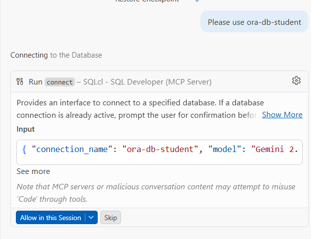

# Vibe Lab — Opus No. 1

> **Oracle Database × AI** — Interact with Oracle Database using natural language through the official Oracle MCP Server and GitHub Copilot inside VS Code.

---

## Table of Contents

- [Vibe Lab — Opus No. 1](#vibe-lab--opus-no-1)
  - [Table of Contents](#table-of-contents)
  - [Prerequisites](#prerequisites)
  - [Concepts](#concepts)
    - [What is an MCP Server?](#what-is-an-mcp-server)
  - [Tutorial](#tutorial)
    - [1. Set Up the Database](#1-set-up-the-database)
    - [2. Verify Your Toolset](#2-verify-your-toolset)
      - [Connect to the Database](#connect-to-the-database)
    - [3. Initialize Schema](#3-initialize-schema)
    - [4. Working with SQL in VS Code](#4-working-with-sql-in-vs-code)
      - [Plain SQL Scripts](#plain-sql-scripts)
      - [Oracle SQL Notebooks](#oracle-sql-notebooks)
    - [5. Create a Dedicated AI Agent User](#5-create-a-dedicated-ai-agent-user)
      - [Why a Dedicated User?](#why-a-dedicated-user)
      - [Creating the User](#creating-the-user)
    - [6. Start Vibe Coding](#6-start-vibe-coding)

---

## Prerequisites

Make sure the following tools are installed before starting. If anything is missing, official documentation and tutorials are widely available online.

| Tool | Notes |
|---|---|
| **Visual Studio Code** | Latest stable release |
| **SQLcl** | [Download](https://www.oracle.com/database/sqldeveloper/technologies/sqlcl/) — extract the `.zip` and add to `PATH` manually |
| **Oracle SQL Developer Extension for VS Code** | Install from the *Extensions* tab in VS Code |
| **GitHub Copilot** | Active licence required |
| **Docker** | Required to run the local Oracle DB container |

**Verify SQLcl installation** by running in your terminal:

```txt
PS > sql
SQLcl: Release 25.4 Production on Sat Mar 28 09:41:03 2026

Copyright (c) 1982, 2026, Oracle.  All rights reserved.

Username? (''?)
```

If you see output similar to the above, the tool is correctly installed.

---

## Concepts

### What is an MCP Server?

**MCP** stands for **Model Context Protocol**. An MCP Server is a bridge between an AI model (e.g., GitHub Copilot, Claude) and external tools or data sources.

**What it enables:**

| Capability | Description |
|---|---|
| Access external data | Connect to databases, APIs, or files |
| Perform actions | Execute commands, read/write data |
| Extend AI capabilities | Give assistants new skills beyond built-in knowledge |

**Key characteristics:**
- Follows a standardized protocol defining how communication happens
- Works like a plugin or extension for AI models
- Enables real-time data access and tool integration
- Runs as a separate service that the AI model communicates with

> Think of it as a **translator and connector** that lets your AI assistant talk to the outside world.

---

## Tutorial

### 1. Set Up the Database

A pre-configured `docker-compose.yml` is provided. Before starting, update the **volumes** section with the correct path on your local machine (Oracle will copy its data files there).

```bash
docker compose -f 'ora\docker-compose.yml' up -d --build
```

Alternatively, click the **play button** next to the file if you have the Docker or Container Tools extension installed.

> **Be patient** — the first startup can take a few minutes.

Wait until you see the following message in the container logs:

```txt
#########################
DATABASE IS READY TO USE!
#########################
```

---

### 2. Verify Your Toolset

Confirm the following are installed and active:

- SQLcl (verified above)
- VS Code extension: **Oracle SQL Developer Extension for VS Code**
- VS Code extension: **GitHub Copilot Chat**
- VS Code extension: **Container Tools** / **Docker** *(recommended)*

> Always install extensions from verified, well-known vendors.

#### Connect to the Database

1. **Open the Oracle SQL Developer Extension** — click its icon in the VS Code sidebar or press `Ctrl+Shift+P` and search for *"Oracle"*.
2. **Add a New Connection** — click the `+` / *Add Connection* button.
3. **Fill in the connection details:**

   | Field | Value |
   |---|---|
   | Connection Name | e.g. `LocalOracleDB` |
   | Hostname / IP | `localhost` (Docker) |
   | Port | `1521` |
   | Service Name | `FREEPDB1` |
   | Username | your Oracle username |
   | Password | your password |

4. Click **Test Connection** and confirm it succeeds.
5. Click **Save** — the connection will appear in the Oracle SQL Developer panel.
6. Expand the connection to browse schemas, tables, and database objects.

---

### 3. Initialize Schema

Connect as the `SYS` user to the `FREEPDB1` service, then run the initialization scripts from [`./init-scripts/`](init-scripts/) **in order**:

```
1.sql → 2.sql → 3.sql → 4.sql
```

---

### 4. Working with SQL in VS Code

#### Plain SQL Scripts

`.sql` files are ideal for quick, straightforward query development:

- Right-click in the editor → **Run Query** (via Oracle SQL Developer Extension)
- Results appear in the **Results** panel below the editor
- Full syntax highlighting and code completion included

#### Oracle SQL Notebooks

`.sqlnb` notebooks combine executable SQL cells with Markdown documentation — great for exploratory analysis and creating reproducible SQL workflows:

- Mix SQL code with written explanations
- Results render inline, immediately below each cell
- Ideal for interactive documentation and sharing analysis sessions

---

### 5. Create a Dedicated AI Agent User

#### Why a Dedicated User?

Running the AI agent under a dedicated, restricted Oracle user is a security best practice aligned with the **Principle of Least Privilege**.

| Benefit | Details |
|---|---|
| **Least Privilege** | Agent can only access what it needs |
| **Isolation** | Agent activity is separated from other system processes |
| **Auditability** | All agent actions are traceable to one account |
| **Risk Containment** | Limits blast radius of any potential vulnerability |
| **Compliance** | Aligns with NIST, CIS, and standard security policies |

#### Creating the User

```sql
-- Create the dedicated user for the AI agent
CREATE USER ai_agent IDENTIFIED BY <strong_password>;

-- Grant basic connection privilege
GRANT CREATE SESSION TO ai_agent;

-- Create a role for easier permission management (recommended)
CREATE ROLE ai_agent_role;
GRANT CREATE SESSION TO ai_agent_role;

-- Grant read-only access to the required tables
GRANT SELECT ON STUDENT.ORDERS        TO ai_agent_role;
GRANT SELECT ON STUDENT.ORDERDETAILS  TO ai_agent_role;
GRANT SELECT ON STUDENT.PAYMENTS      TO ai_agent_role;
GRANT SELECT ON STUDENT.EMPLOYEES     TO ai_agent_role;
GRANT SELECT ON STUDENT.CUSTOMERS     TO ai_agent_role;
GRANT SELECT ON STUDENT.OFFICES       TO ai_agent_role;
GRANT SELECT ON STUDENT.PRODUCTS      TO ai_agent_role;
GRANT SELECT ON STUDENT.PRODUCTLINES  TO ai_agent_role;

-- Assign the role to the user
GRANT ai_agent_role TO ai_agent;

-- Verify
SELECT username FROM dba_users WHERE username = 'AI_AGENT';
```

> **Security notes:**
> - Replace `<strong_password>` with a randomly generated, strong password.
> - Regularly audit and rotate credentials.
> - **Never** grant `DBA` or any administrative privilege to the AI agent user.

---

### 6. Start Vibe Coding

1. Open the **Copilot Chat** panel in VS Code.
2. Click **Configure tools** and confirm that **"SQLcl – SQL Developer"** is visible and checked.
3. Ask Copilot to confirm access:

   > *"Do you have access to the SQLcl MCP server? Can we vibe code together with Oracle Database?"*

   You will be prompted to approve the **list-connections** action — accept it.

   

4. Tell the agent which connection to use and let it connect:

   

5. Start exploring your database with natural language prompts, for example:

   > *"Describe the database — the tables, their relationships, and the business domain they represent."*

   From here the possibilities are endless. Try asking the agent to:
   - Write and explain a SQL query in natural language
   - Review the data model and suggest improvements
   - Generate a short business summary or report
   - Solve the lab tasks below

> You are only limited by your imagination. 😊


